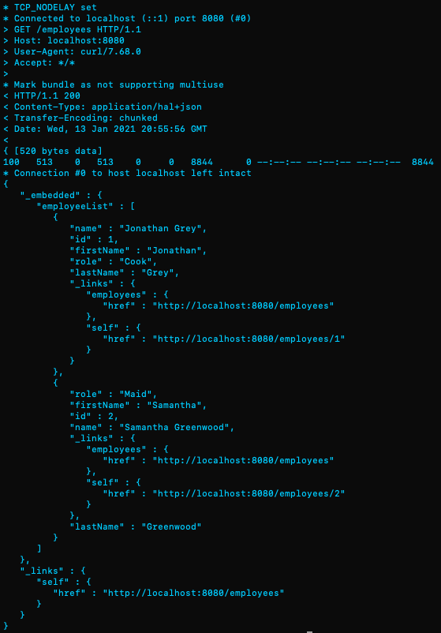

# SpringBoot-RESTful-Program

An employee and employee orders management program made with a RESTful architecture.

Written with SpringBoot/Jpa/HATEOAS.

All objects data are represented with resource links instead of plain Java data. The use of HTTP methods (GET, POST, PUT and DELETE) allows easier data manipulation. 

Each object contains a unique URI.

Here is an example for showing all employees on the command line.
Command : `curl -v -X GET <servername>:<portnumber>/employees | json_pp`\

### Reference Documentation
For further reference, please consider the following sections:

* [Official Apache Maven documentation](https://maven.apache.org/guides/index.html)
* [Spring Boot Maven Plugin Reference Guide](https://docs.spring.io/spring-boot/docs/2.4.1/maven-plugin/reference/html/)
* [Create an OCI image](https://docs.spring.io/spring-boot/docs/2.4.1/maven-plugin/reference/html/#build-image)
* [Spring Web](https://docs.spring.io/spring-boot/docs/2.4.1/reference/htmlsingle/#boot-features-developing-web-applications)
* [Spring Data JPA](https://docs.spring.io/spring-boot/docs/2.4.1/reference/htmlsingle/#boot-features-jpa-and-spring-data)

### Guides
The following guides illustrate how to use some features concretely:

* [Building a RESTful Web Service](https://spring.io/guides/gs/rest-service/)
* [Serving Web Content with Spring MVC](https://spring.io/guides/gs/serving-web-content/)
* [Building REST services with Spring](https://spring.io/guides/tutorials/bookmarks/)
* [Accessing Data with JPA](https://spring.io/guides/gs/accessing-data-jpa/)

